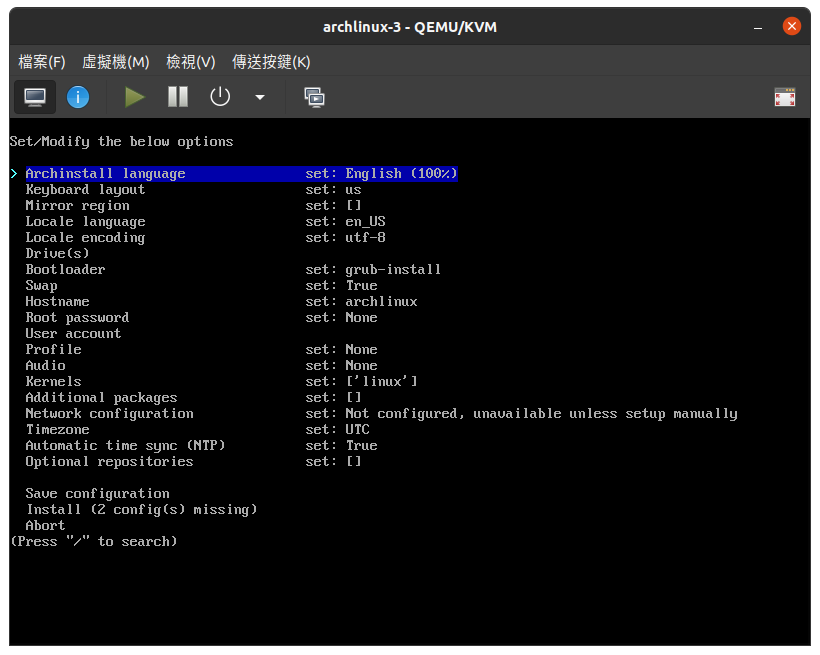
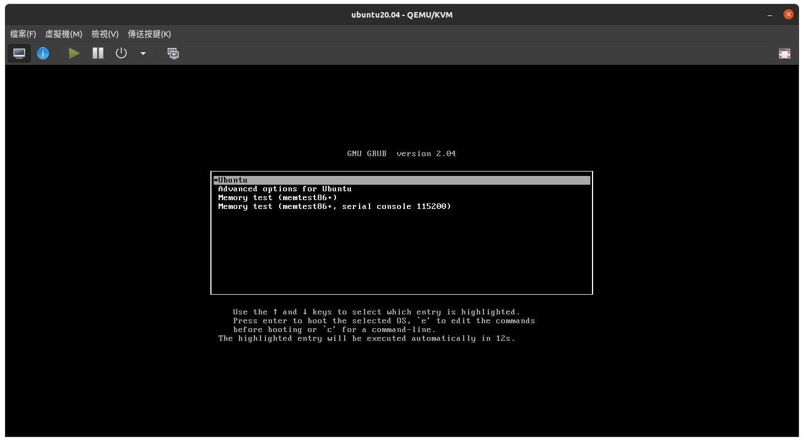
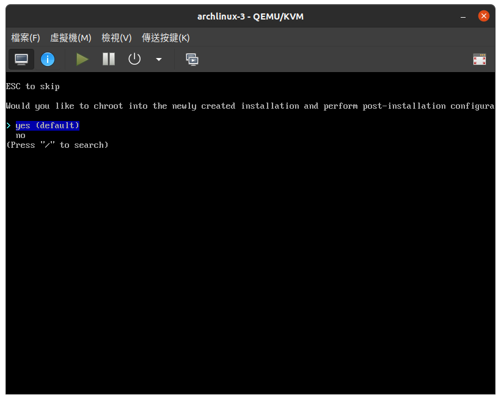
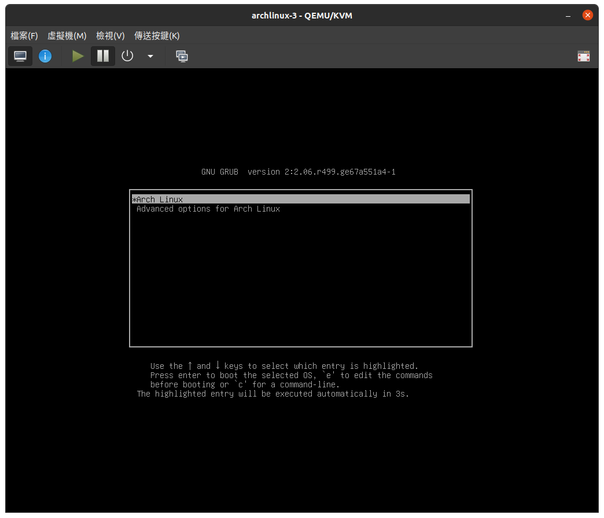
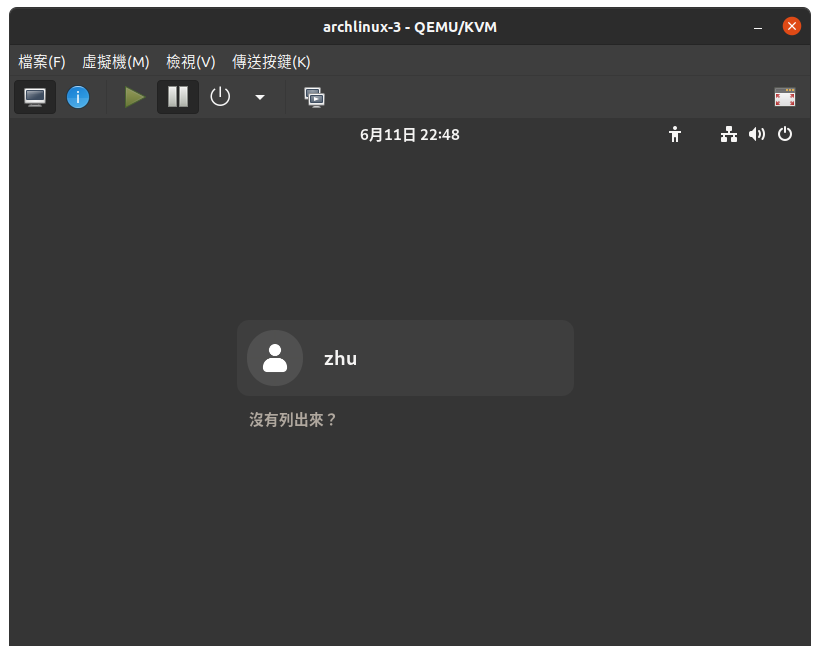
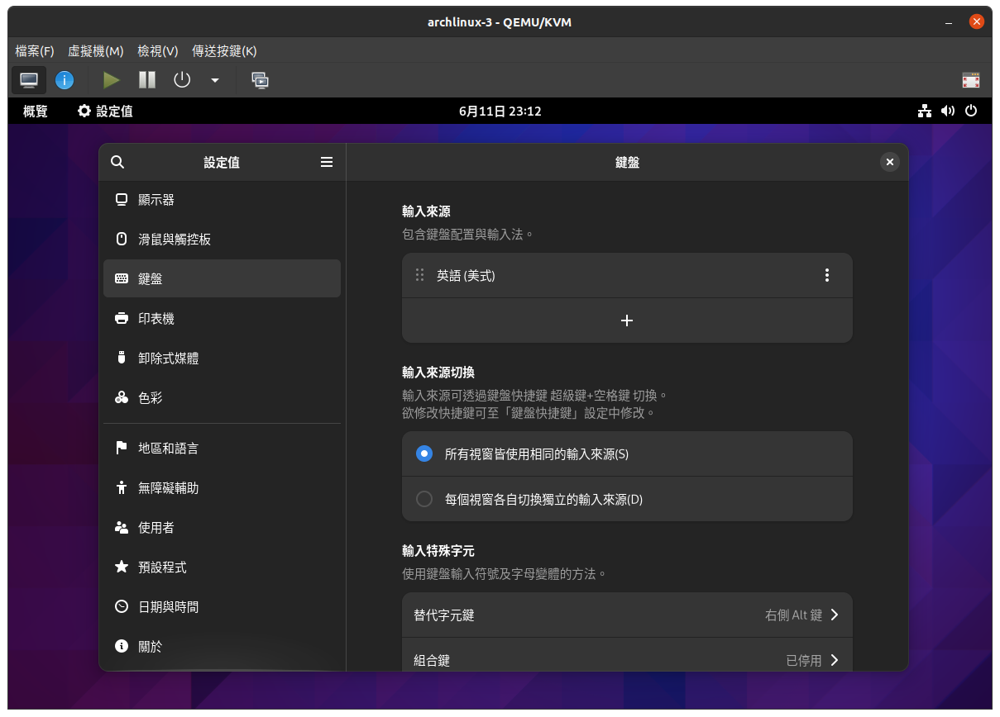

(方案一) 使用archinstall安裝
===========================================

傳統安裝arch linux需要對linux的指令以及系統有一定熟悉度，上手門檻比較高，
而且需要輸入許多指令，費時費力。
於是就有人編寫了arch linux的安裝腳本，只需要使用方向鍵選擇選項即可完成安裝,
不僅幫助人們省下了輸入大量指令的時間，而且也降低了上手的門檻。
基本上使用起來就跟安裝ubuntu的時候差不多，
都是給你一些選項點一點然後下一步，
只不過改成純文字界面跟方向鍵選擇選項。

要想使用腳本安裝，只需要執行 ``archinstall`` ，就會進入下面的腳本安裝界面:

操作方法是使用方向鍵來選擇選項，輸入 ``enter`` 來選定，輸入 ``esc`` 來跳過。
如果選項太多，可以輸入 ``/`` 來搜索你想要的選項。

設定地區和語言
----------------

基本上想先設定哪個項目都是可以的，順序不影響。
這邊我們首先從語言和時區相關的項目開始設定。

archinstall language
~~~~~~~~~~~~~~~~~~~~~~~~~

這邊設定終端顯示的語言，維持英文就好(因為也沒有中文)。

Keyboard layout
~~~~~~~~~~~~~~~~~~~~~~~~~

這邊是設定鍵盤布局，也是維持預設就好。

Mirror region
~~~~~~~~~~~~~~~~~~~~~~~~~

這邊是設定你的軟體更新要從哪邊獲取，這邊選 ``Taiwan`` 。

Locale language
~~~~~~~~~~~~~~~~~~~~~~~~~

這邊才設定繁體中文作為我們的語言，我們選擇 ``zh_TW.UTF-8`` 。

Locale encoding
~~~~~~~~~~~~~~~~~~~~~~~~~

編碼選擇 ``utf-8`` 。

Timezone
~~~~~~~~~~~~~~~~~~~~~~~~~

捷下來我們跳到後面來設定時區，由於內容很多請善用 ``/`` 的搜索功能。

這邊我們選擇 ``Asia/Taipei`` 。

Automatic time sync
~~~~~~~~~~~~~~~~~~~~~~~~~

這邊維持 ``true`` 表示自動同步時間。

設定用戶與安裝預設軟體
-------------------------

這邊我們要設定用戶的帳號密碼，
以及一些你會需要預先安裝的額外軟體。

Hostname
~~~~~~~~~~~~~~~~~~~~~~~~~

這項可以設定你的主機名稱。

Root password
~~~~~~~~~~~~~~~~~~~~~~~~~

這邊需要設定root的密碼。

這邊跟不了解的新手解釋一下，
在ubuntu中一般正常使用應該是不會登入到一個叫root的用戶的,
然而這個用戶是真實存在在你的系統中的。
root用戶是系統中擁有最高權限的用戶，能在系統中做任何事情，
比如修改系統設定或是刪除重要的檔案，這些事情基於安全考量是不能開放給其他用戶使用的。

root用戶就類似家長的角色，一般用戶就類似於小朋友的角色。
所以如果小朋友想做一些大人的事情(?)，都必須通過root用戶來完成。
一般的做法就是在指令前加上 ``sudo`` ，這樣就相當於是你使用root帳號在執行指令。
當然，並不是所有的用戶都可以有權力可以使用 ``sudo`` 的，需要我們另外設置。

在一般的系統中我們必須建立一個root用戶，
並且建議建立一個普通用戶作為日常使用，
同時該用戶有權使用 ``sudo`` 來在必要時完成一些需要root權限的操作。

User account
~~~~~~~~~~~~~~~~~~~~~~~~~

這邊我們建立一般用戶。

選擇項目後，選擇 ``Add a user``。然後輸入用戶名稱跟密碼。

接下來會問你須不需要給該用戶使用 ``sudo`` 的權限，這邊選 ``yes`` 。

.. image:: ./img/Screenshot-20230611155933-820x655.png
  :width: 500

進入一個新的界面，是問你要不要再加其他用戶。
需要的話就選 ``Add a user`` ，不然就選 ``confirm and exit`` 返回。

Additional Packages
~~~~~~~~~~~~~~~~~~~~~~~~~

這邊輸入要額外安裝的程式名稱，
比如說瀏覽器之類的，也可以等安裝好arch進入系統再裝。

不過中文字體還是建議先裝起來的，這樣進入系統後中文才能正常顯示。
輸入 ``noto-fonts-cjk`` 安裝中文字體。

另外如果你是使用虛擬機，建議可以額外安裝 ``spice-vdagent`` 來增強使用體驗。

設定硬碟
--------------

這步驟主要就是硬碟分區跟建立檔案系統。

對於不了解的新手可以簡單理解成，
我們要選擇把系統安裝在哪個硬碟上，
然後要把系統安裝到硬碟上的時候要選擇什麼樣的"格式"去保存。
不同的保存格式，會影響到我們的電腦開機的時候要怎麼去找到我們剛剛保存到硬碟上的資料。

Drive(s)
~~~~~~~~~~~

一開始會要你選擇你要把系統安裝到哪個硬碟上。

選好之後會回到主界面，同時會看到多了一個`Disk layout`選項。

進入該選項後，我們選第二項 ``Wipe all selected drives ...`` ，
讓程式幫我們自動清理整個硬碟，並保存系統。
如果選擇第一項則是手動分割分區，
這邊我們留到後面使用傳統方式安裝arch linux時再介紹。

然後我們會進入到選擇檔案系統的頁面，
新手可以理解成我們前面說的保存資料的"格式"。
這邊可以看到有很多的檔案系統可以選擇，
基本上如果你不知道要選哪個就選 ``ext4`` 。

選擇 ``ext4`` 後會多出一個 ``Disk encryption`` 的選項，
基本上沒有很高的安全需求，直接忽略就好。

Boot loader
~~~~~~~~~~~~~~~~~~

這邊是設定引導程式，我們選擇 ``grub`` 。

這邊幫新手解釋一下什麼是引導程式。
所謂引導程式就是電腦開機後，把作業系統啟動起來的程式，
簡單來說這個程式就是會在開機後給你一個界面，
讓你選擇要啟動哪個作業系統或是哪個kernal啟動
(如果你電腦有裝多個作業系統的話)。

一般來說如果你電腦只有裝一個ubunut的話是看不到這個界面的，
但是可以通過修改grub的配置文件就能在開機時看到下面這樣的畫面:

Swap
~~~~~~~

這邊設定虛擬記憶體，
但老實講現在記憶體都足夠多了，所以有沒有Swap應該都無所謂。

設定桌面環境
---------------

下面我們要配置桌面環境，
基本上應該沒有人想安裝一個只有黑白終端可以用的電腦，
除非你是在安裝server。

這邊幫新手介紹一下什麼是桌面環境，
基本上桌面環境就是你打開ubuntu會看到的任務欄跟窗口，
這些圖形化的界面以及一些幫你預裝的軟體，
都是屬於桌面環境。

而我們前面說的linux作業系統其實只是一個程式或者說是kernal，
作用是讓電腦上使用者的程式可以正常運作，所以kernal的任務並不包括幫我們顯示任務欄之類的。
而我們是不能直接跟kernal互動的，如果我們要執行一個程式(比如打開瀏覽器)，
需要通過其他程式去幫我們跟kernal說我們要運行一個程式(瀏覽器)。
這邊的“其他程式”可以是你很熟悉的終端機，也可以是一個圖形化的界面，比如你的ubuntu桌面。

如果是通過終端機打開firefox，就直接在終端輸入 ``firefox`` 然後執行。
而如果是通過桌面環境，就是去點你工具列上的firefox的icon。

Profile
~~~~~~~~~~~~~

這邊是問你要建立一個完整的桌面環境，
還是要一個只有黑白終端界面的服務器，
還是你想要一個只有基本的窗口管理程式(不含一些其他配套程式)的環境。
這邊我們選 ``desktop`` 來建立一個完整的桌面環境。

接下來會看到一大堆各種的桌面環境給你選擇，
基本上最受歡迎的兩個選擇就是 ``gnome`` 和 ``kde`` 。
如果你是ubuntu的用戶並且喜歡ubuntu的界面，就選擇 ``gnome`` 。

題外話，雖然大家都推薦windows用戶使用kde，
但發現我身邊的windows用戶都比較喜歡gnome或cinnamon。

接下來就是根據自身的電腦硬體選擇顯示卡驅動，
基本上AMD跟Intel沒什麼好選的，反正就一個選項。
而Nvidia推薦選 ``open kernal module for newer GPUs, Turing+`` 。

Audio
~~~~~~~

使用預設選項即可。

Kernals
~~~~~~~~~~

使用預設選項即可。

Network Configuration
~~~~~~~~~~~~~~~~~~~~~~~~~

這邊選 ``NetworkManager`` 即可。

Optional repositories
~~~~~~~~~~~~~~~~~~~~~~~~

這邊看需不需要額外的軟體庫，如果不知道就選 ``multilib`` 。

安裝arch linux和安裝新酷音
--------------------------

安裝arch linux
~~~~~~~~~~~~~~~

設定完全部的選項後記得回頭檢查是否有遺漏的選項，
好了以後就可以選擇 ``install`` 直接安裝即可。

下個畫面會需要你輸入enter繼續，然後就可以去泡杯咖啡等安裝完成了。

然後你會看到下面這個畫面:

選擇 ``no`` 直接結束。

然後我們會回到一開始的畫面，這時候只需要輸入 ``reboot`` 重啟即可。

終於進入桌面環境
~~~~~~~~~~~~~~~

然後我們會進入前面有提過的GRUB界面，這邊選擇第一個 ``Arch Linux``:

然後我們就會進入登入界面了:

這邊輸入使用者密碼(不是root密碼)。

恭喜你進入桌面環境！

題外話，對於ubuntu用戶來說，雖然都是gnome的桌面環境，
但還是跟ubuntu的桌面環境有些不太一樣的地方。
比如ubuntu商店不見了，沒有內建辦公軟體或是內建的播放器。
這是因為現在這個才是gnome原本的樣子，ubuntu的gnome桌面環境其實是經過ubuntu修改過的。
也就是說你需要的程式都需要自己去安裝，系統並不會幫你裝你不需要的程式。

安裝新酷音
~~~~~~~~~~~

在ubuntu上預設是使用新酷音，如果你想沿用新酷音。
就打開終端機(主控臺)輸入:

.. code-block:: shell-session

    sudo pacman -S ibus-chewing

接下來登出再登入後(直接重啟也可以)，打開設定來到鍵盤:

點選輸入來源的+號添加輸入來源，選擇中文跟加入新酷音。

然後你就可以用 ``super + 空白鍵`` 切換打字的語言了。

