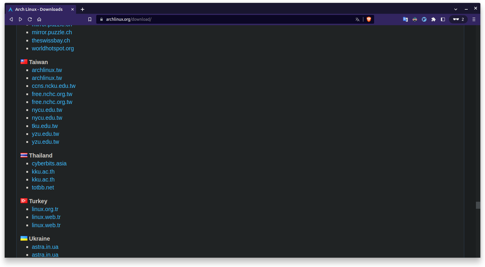
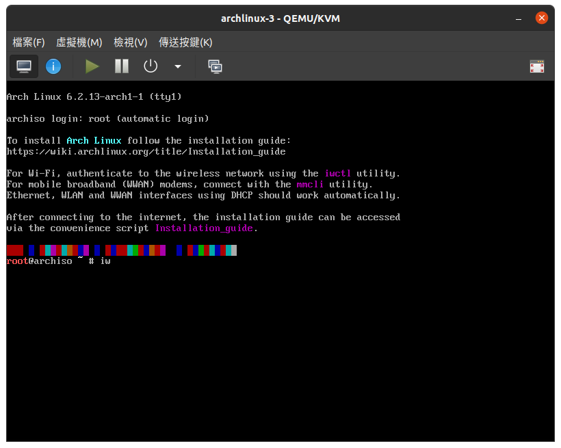
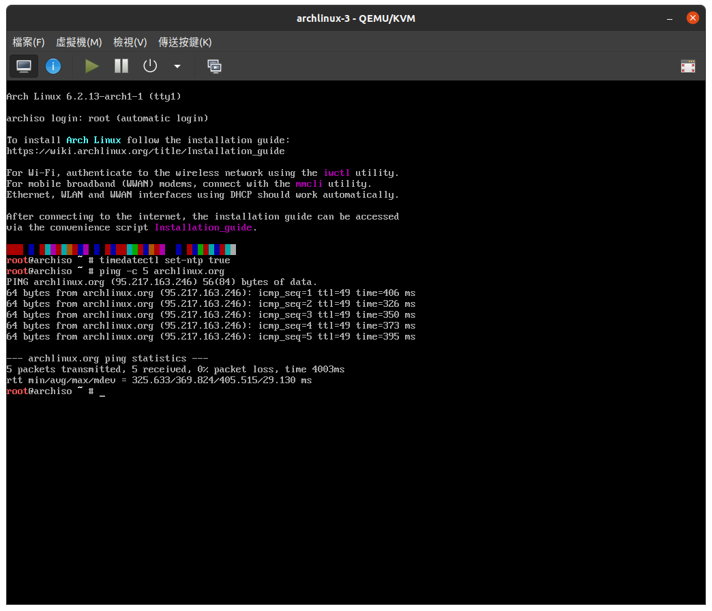

前言
===========================================

這篇是以一個ubuntu用戶的視角寫的arch linux新手安裝指南，
但其實如果你使用的是其他的linux distros的linux新手也可以參考看看。

這篇會使用兩種不同的方式來安裝arch linux，
並且安裝gnome桌面環境以及一些中文使用者會需要的一些額外程式。
第一種安裝方式是使用archinstall來安裝，第二種是使用傳統的方式來安裝。

如果你是第一次安裝arch linux，我推薦使用第一種方式安裝，
上手門檻比較低，而且可以先熟悉一些基本的觀念，
了解一個我們日常使用的桌面系統是由哪些部份組成的。
而第二種方式推薦給想要挑戰的玩家，過程中會涉及到許多linux的觀念，
比如: 分區, 檔案系統, grub, 桌面環境, 軟體套件管理系統(ubunut上的apt)。
如果你只是想要快速的把arch linux裝起來，
就選擇第一種方式吧，第一次安裝大概會花費20～30分鐘。

開始前的準備
-----------------

首先是到 `官網 <https://archlinux.org/download/>`_ 下載iso文件，頁面往下拉找到台灣，隨便選一個就可以了:

arch linux跟ubuntu比較不一樣的地方在於，arch linux是rolling release的發行版，
所以不像ubuntu有分ubunut20,ubuntu21,ubuntu22之類的版本號碼。
也就是說arch linux相當於永遠只有一個叫做“最新版”的版本，這樣設計使得arch linux上面運行的軟體永遠是最新的，
壞處就是不像ubuntu會幫你打補丁解決一些問題，出事要自己動手解決。
如果是ubuntu用戶應該能體會每次ubuntu釋出新版本的時候，備份資料跟重新安裝實在麻煩，
而arch linux就沒這個問題。

下載好iso文件後就可以裝到虛擬機或是實機上了。

下面的補充是給新手用戶如何在linux製作開機usb的說明，不需要的可以直接跳過。

(補充) 如何在linux上製作開機usb
----------------------------------

在ubuntu上有提供一個叫 `製作開機碟` 的程式，但是好像只能用來安裝ubuntu的iso。

如果想製作非ubuntu的開機usb，可以去下載專門製作開機usb的程式，但是這邊要介紹的是如何使用命令行來完成。

首先執行 ``lsblk`` 可以查看當前電腦上的裝置，
然後插入usb到你的電腦，再次查看電腦上的裝置，應該會發現多了一個新裝置(ex: sda, sdb)。

下面是我電腦上的顯示:

.. code-block:: shell-session

    NAME        MAJ:MIN RM   SIZE RO TYPE MOUNTPOINT
    sda           8:0    1  28.5G  0 disk 
    ├─sda1        8:1    1   1.9G  0 part /media/zzz/Fedora-WS-Live-37-1-7
    ├─sda2        8:2    1    10M  0 part 
    └─sda3        8:3    1   300K  0 part 
    nvme0n1     259:0    0   477G  0 disk 
    ├─nvme0n1p1 259:1    0   512M  0 part /boot/efi
    └─nvme0n1p2 259:2    0 476.4G  0 part /

這邊的nvme0n1就是我電腦原本的硬碟，sda就是我的usb，sda1是usb中的一個分區。
可以看到在 `MOUNTPOINT` 欄位下面會顯示掛載點，新手可以理解成把硬碟中的分區對應成電腦中的資料夾。
也就是說我到 `/media/zzz/Fedora-WS-Live-37-1-7` 資料夾中就可以進入sda1。

接下來就可以把iso文件寫入到usb中了，不過在這之前要先卸載裝置。在我這邊的例子是:

.. code-block:: shell-session

    umount /media/zzz/Fedora-WS-Live-37-1-7 

.. note::

    卸載usb的掛載點就好，不要卸載到其他裝置的掛載點喔。

接下來用 ``dd`` 指令製作開機usb:

.. code-block:: shell-session

    dd if={ios文件路徑} of={裝置名稱} bs={blocksize}

把路徑跟裝名稱改成自己的就好，``blocksize`` 是用來設定每次寫入時的大小(ex: 512k)，
下面是我的例子:

.. code-block:: shell-session

    dd if=/home/zzz/下載/archlinux-2023.06.01-x86_64.iso of=/dev/sda bs=512k

完成後拔出usb，就可以準備安裝arch linux了。

進入安裝界面
--------------

下面我使用QEMU/KVM來演示如何安裝arch linux，
並安裝gnome桌面環境。

電腦如果有正確的讀取到開機usb，會看到這樣的界面:

.. image:: ./img/Screenshot-20230609153902-820x655.png
  :width: 500

這邊選第一個，然後進入到下面這個畫面:

從這邊就正式開始了，首先要確認網路連線。

確認網路連線
-------------

確認是否連線可以使用 ``ping`` 指令，下面是例子:

.. code-block:: shell-session

    ping -c 5 archlinux.org

如果有連上網路應該會像下面這樣:

如果是使用虛擬機安裝的，
只要你本機是可以連網的，那下面的步驟可以省略了。
如果是使用實體機器安裝的，
最省事的辦法就是使用有線網路，如果是筆電可以去三井買網路孔轉usb的轉接器上網。

如果可以連上網路就可以跳過下面使用wifi上網的說明了。

首先輸入 ``iwctl`` 進入交互界面，接下來會發現出現綠色的 ``[iwd]`` 字樣。

可以輸入 ``help`` 查看有提供哪些功能來協助我們管理無線網路，
詳細參考 `arch維基 <https://wiki.archlinuxcn.org/zh-tw/Iwd>`_ 。
在這邊我們要輸入 ``device list`` 查看有哪些無線網路的設備可以使用，
下面是範例:

.. code-block:: shell-session

    [iwd]# device list
                               Devices
    ---------------------------------------------------------------
    Name          Address          Powered    Adapter    Mode
    ---------------------------------------------------------------
    wlan0                          on         phy0       station

在我的例子中我的網路裝置名稱是 ``wlan0`` ，狀態是開啟的(``on``)。
如果沒開啟，請參考下面命令開啟:

.. code-block:: shell-session

    [iwd]# device {網路裝置名稱} set-property Powered on

然後輸入下面的指令查看有哪些網路可以連接:

.. code-block:: shell-session

    [iwd]# station {網路裝置名稱} scan
    [iwd]# station {網路裝置名稱} get-networks

下面是顯示範例:

.. code-block:: shell-session

                                  Available networks
    --------------------------------------------------------------------------------
      Network name                    Security          Signal
    --------------------------------------------------------------------------------
      wifi-1                          psk               ****
      wifi-2                          psk               ****

在`Network name`欄位中會顯示附近wifi的名稱，
如果我要連接`wifi-1`的話就輸入:

.. code-block:: shell-session

    [iwd]# station wlan0 connect wifi-1 --passphrase {wifi密碼}

一切就緒，下面就來正式安裝arch linux了，
下面提供兩種方案來安裝arch linux:
    1. 使用archinstall安裝
    2. 使用傳統方式安裝

