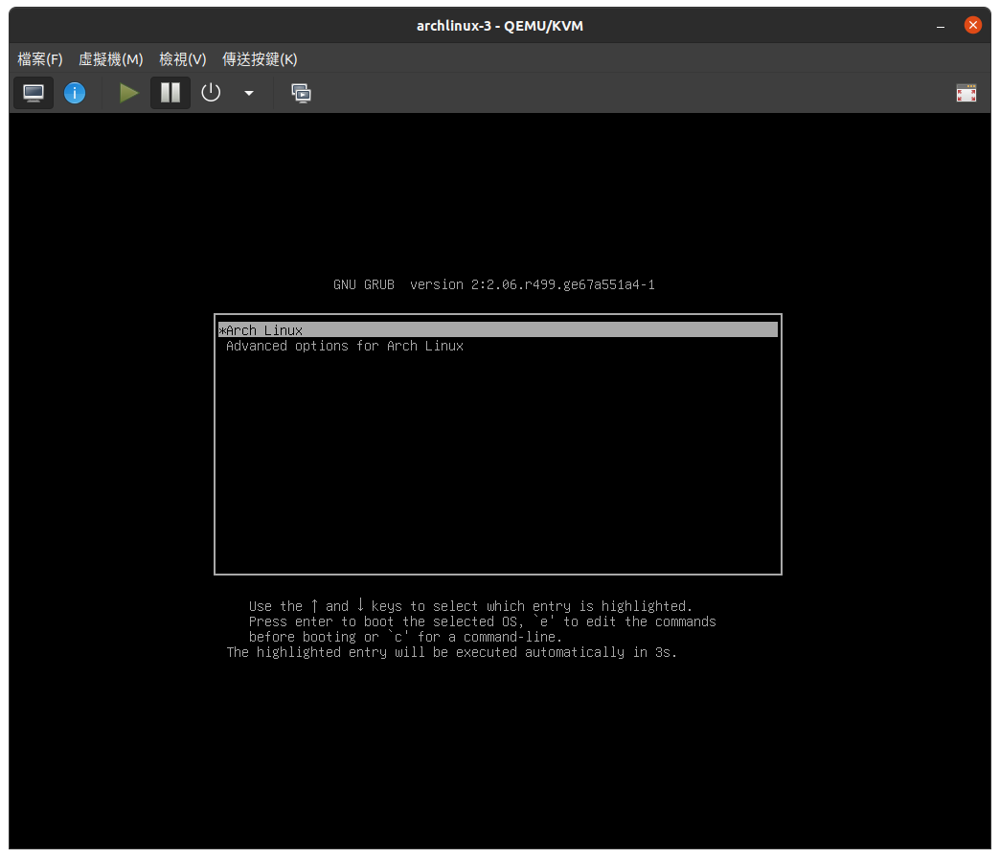
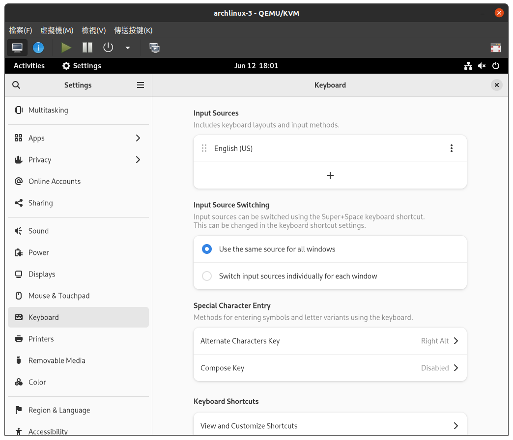

(方案二) 使用傳統方式安裝
=========================

這邊我們不使用 ``archinstall`` 來安裝，
安裝過程會涉及到比較多的指令，
如果第一次嘗試可能會感覺很複雜，
但是只要跟著下面的流程走一定能裝好，
並且相信你最後一定能收穫頗豐。

基本上安裝過程可以分成4個階段:
    1. 硬碟處理: 就是在把系統安裝到硬碟前需要的一些處理
    2. 系統安裝: 把作業系統核心跟其他相關的程式安裝到硬碟上
    3. 系統配置: 把系統做一些基本的配置，讓系統可以正常啟動
    4. 安裝桌面環境: 安裝一些圖形化的界面工具讓系統易於使用

在開始前，我們先使用下面的指令來同步系統時間:

.. code-block:: shell-session

    timedatectl set-ntp true

然後我們就可以正式開始了。

硬碟處理
---------------

我們先從最難的硬碟處理開始。

這邊先簡單介紹一下等等要做的內容。
首先我們會幫硬碟分區，我會分成三個分區，
一個是Swap分區，一個是根分區，一個是boot分區。
然後我們會把系統安裝到分區上，並掛載分區。

查看硬碟
~~~~~~~~~~~~

開始分區前我們需要先知道要對哪個硬碟分區，可以使用下面的指令查看:

.. code-block:: shell-session

    fdisk -l

應該會看到類似下面這樣的畫面:

無視設備名稱中帶有 `loop` , `rom` 或是 `airoot` 的，
在我們這邊就是無視 `dev/loop0` ，
然後從剩下的設備中選擇你要安裝作業系統到哪個硬碟上，
在這個例子中是選擇 `dev/vda` 。

選擇分割表類型
~~~~~~~~~~~~

其他網路上的教學，這邊常見的工具是 `fdisk` ，
這邊我們推薦一個對新手更友善的工具 `cfdisk` 。

執行下面指令對 `/dev/vda` 分區:

.. code-block:: shell-session

    cfdisk /dev/vda

接下來會看到一個選擇菜單，要你選擇使用哪種格式分區。
基本上會從 `gpt` 跟 `dos` 中選擇，順帶一提這邊的 `dos` 就是MBR。

如果你是新手，可以用下面的順序判斷你要選哪種格式分區:

    1. 使用虛擬機安裝 -> 都可以
    2. 電腦不支援UEFI -> dos
    3. 硬碟空間大於2T -> gpt
    4. 以上皆非 -> 都可以

基本上MBR的類型是應用最廣範的，大部分的硬體都可以支援。
而使用gpt類型可以獲得比MBR更多更好的功能。

下面我會使用MBR來演示分區。

硬碟分區(MBR)
~~~~~~~~~~~~

選擇 ``dos`` 按enter後進入下面的畫面:

使用上下方向鍵選擇分區，使用左右方向鍵選擇要進行什麼操作。
在當前畫面中我們沒有分區，所以直接選擇 ``[ New ]`` 來建立分區。

接著會讓你選擇新建分區的大小，比如我想先建立boot分區，並且大小為512M。
所以我輸入512M，然後按enter。接下來會讓你選擇分區的類別，選擇 ``primary`` 就可以。

接下來會回到主畫面，然後你就可以使用上下鍵選擇要對哪個分區進行操作了。
比如我發現我剛剛的分區分錯了，我就通過上下鍵選擇剛剛分出來的分區，
然後使用做左右鍵選擇 `` [Delete] `` 選項。

如果要繼續分割分區就通過上下鍵選擇 ``Free space`` ，一樣選擇 ``[ New ]`` 。
這邊我們試試看swap分區，輸入大小後，一樣選擇 ``primary`` 。
回到主界面後，選擇swap分區的 ``[ Type ]`` 選項:

出現選單畫面後選擇 ``82 Linux swap / Soloris`` 。

最後把所有的空間分給最後一個分區(輸入大小時可以直接敲enter)。
選擇 ``primary`` 後，選擇 ``[ Write ]`` ，輸入 ``yes`` ，再選擇 ``[ Quit ]`` 離開。

出來後可以用 ``fdisk -l`` 查看剛剛的成果。

建立檔案系統
~~~~~~~~~~~~~~~~

下來我們要在剛剛的硬碟上建立檔案系統。
我們延續前面是使用 ``archinstall`` 安裝arch linux時的設定，
使用 `ext4` 檔案系統安裝。

可以參考下面的指令:

.. code-block:: shell-session

    mkfs.ext4 /dev/vda1
    mkfs.ext4 /dev/vda3
    mkswap /dev/vda2
    swapon /dev/vda2

系統安裝
--------------

前面我們完成了對硬碟的基本配置，下面我們就可以在硬碟上安裝我們的系統了。

掛載分區
~~~~~~~~~~~~

首先我們需要掛載分區，也就是分區對應到系統中的一個資料夾。
這樣我們的程式才能通過這個資料夾把系統安裝到分區上。
通常我們會當前硬碟對應到 `/mnt` 這個資料夾下，
在我們的例子中，我打算把 `/dav/vda1` 對應到 `/mnt/boot` ，
然後把 `/dav/vda3` 對應到 `/mnt` 。
使用下面的指令:

.. code-block:: shell-session

    mount /dev/vda3 /mnt
    mkdir /mnt/boot
    mount /dev/vda1 /mnt/boot

安裝並進入系統
~~~~~~~~~~~~

輸入下面指令把系統安裝到 `/mnt` 資料夾中:

.. code-block:: shell-session

    pacstrap /mnt base base-devel linux linux-firmware

安裝會花點時間，可以去泡個咖啡再回來☕。

安裝完成後我們其實就已經可以在我們新裝好的系統上玩耍了。
這邊可以使用大家熟悉 ``ls`` 指令去看一下我們剛剛安裝了系統的 `/mnt` 目錄，
你會發現 `/mnt` 目錄中已經裝好了一個你熟悉的linux檔案系統。
但是先不要急，我們還有一個重要的事情需要做，
就是設定開機後自動掛載硬碟，這邊可以用 ``genfstab`` 命令自動生成掛載規則:

.. code-block:: shell-session

    genfstab -U /mnt

只需要把規則寫入到 `/mnt/etc/fstab` 就可以了:

.. code-block:: shell-session

    genfstab -U /mnt >> /mnt/etc/fstab

大功告成！下面我們只需要chroot到 `/mnt` 中就可以了:

.. code-block:: shell-session

    arch-chroot /mnt 

然後你會驚奇的發現你的命令提示改變了，
因為此時你已經真正的進入你安裝在硬碟中的新系統中了。
接下來我們就在新系統中完成剩下的安裝工作。

系統配置
--------------

進入系統後我們首先要安裝的是一些基本服務，
比如說網路管理和grub，
讓系統在重啟後可以正常運作。
當然別忘了還要配置帳號密碼語言時區之類的基本設定。

配置基本服務
~~~~~~~~~~~~~

在ubuntu中我們使用 ``apt`` 安裝軟體，
在arch中我們使用 ``pacman`` :

.. code-block:: shell-session

    pacman -S networkmanager grub

然後我們把網路服務啟起來:

.. code-block:: shell-session

    systemctl enable NetworkManager

然後我們來配置GRUB:

.. code-block:: shell-session

    grub-install /dev/vda
    grub-mkconfig -o /boot/grub/grub.cfg

完成基本的服務配置這樣就機器就可以正常開機使用了，
但是我們要先配置一些與使用者相關的設定。

新增用戶與主機名稱
~~~~~~~~~~~~~~~~

等等會需要修改一些檔案，所以建議可以安裝一個順手的文字編輯器，
比如說vim:

.. code-block:: shell-session

    pacman -S vim

首先我們要做的第一件事情是幫root用戶設定一個密碼:

.. code-block:: shell-session

    passwd

再來我們來建立一個普通用戶，並且是可以使用 ``sudo`` 的。

.. code-block:: shell-session

    useradd -mg wheel {用戶名}
    passwd {用戶名}

接下來執行 ``visudo`` ，把下面這行的註釋(#)去掉:

.. code-block:: shell-session

    %wheel ALL=(ALL:ALL) ALL

看起來項下面這樣:

然後打開 `/etc/hostname` 寫入你的主機名稱。

配置語言與時區
~~~~~~~~~~~~~~

編輯 `/etc/locale.gen` ，
把 ``zh_TW.UTF-8`` 前面的註解(#)去掉。

然後執行:

.. code-block:: shell-session

    locale-gen

接著在 `/etc/locale.conf` 中加入 ``LANG=en_US.UTF-8`` 。

最後我們來設定時區:

.. code-block:: shell-session

    ln -sf /usr/share/zoneinfo/Asia/Taipei /etc/localtime

重啟系統
~~~~~~~~~~~~~~

接下來輸入 ``exit`` ，然後輸入 ``reboot`` 重啟系統。

如果你grub安裝正確，應該可以看到grub的畫面了。
選擇 ``Arch Linux`` 進入系統:

登入我們之前建立的用戶，恭喜你已經完成基本的arch linux安裝了。
但是雖然當前的系統可以正常運作了，卻只有文字界面可以使用，
通常我們會希望使用圖形界面跟鍵盤滑鼠的方式來使用電腦，
所以我們需要幫當前系統安裝桌面環境。

安裝桌面環境
---------------

安裝好系統之後，下面就來安裝桌面環境，
然而選擇什麼樣的桌面環境對新手來說可能是一個很困難的問題，
但如果是ubuntu的用戶一定對gnome的桌面環境不陌生，
所以下面就使用gnome來示範如何安裝桌面環境。

題外話，如果是新手的第一次安裝桌面環境可能常常忘記安裝一個東西，
就是顯示管理器(display manager)。
顯示管理器的作用就是在你進入桌面環境前給你一個登入界面，
讓你可以選擇某個帳號登入某個桌面環境，
在我們下面的例子中使用的是 `gdm` 。

當然你也可以不需要使用顯示管理器來登入你的桌面環境，
也有人是喜歡使用手動登入桌面環境的。

安裝gnome
~~~~~~~~~~

首先更新:

.. code-block:: shell-session

    sudo pacman -Syu

然後安裝gnome桌面環境和相關程式:

.. code-block:: shell-session

    sudo pacman -S xorg gnome gnome-extra gdm

然後剩下來遇到的問題全部按 `enter` 就可以了。
友情提示，這個會裝比較久，可以去吃個飯再回來🍚。

安裝好之後，我們把 `gdm` 啟動起來:

.. code-block:: shell-session

    sudo systemctl enable gdm

這樣就可以像ubuntu一樣，通過登入界面進入桌面環境了。

安裝中文字體
~~~~~~~~~~~~

接下來為了等等進入桌面系統後可以正常顯示中文字，
我們需要安裝中文字體:

.. code-block:: shell-session

    sudo pacman -S noto-fonts-cjk noto-fonts-emoji

在ubuntu中預設的中文打字軟體是新酷音，
所以如果想沿用ubuntu方式可以安裝新酷音:

.. code-block:: shell-session

    sudo pacman -S ibus-chewing

桌面環境設置
~~~~~~~~~~~~~~

接下來就是輸入 ``reboot`` 重啟系統，並看到登入界面。
然後就可以看到桌面環境了:

然後你會發現界面都是英文的...

要想改成中文只需要進入設置，
找到 ``Region & Language`` 點開Language，
找到中文然後選擇就可以了。

接著只需要登出或重啟界面就會變成中文了。

然後中文打字也是一樣，
在設定中找到 ``keyboard`` ，點+號，找到 ``Chinese(Chewing)`` 添加。
接著登出或重啟。

最後如果是使用虛擬機的話，
可以考慮安裝 ``spice-vdagent`` 來提昇使用體驗。

